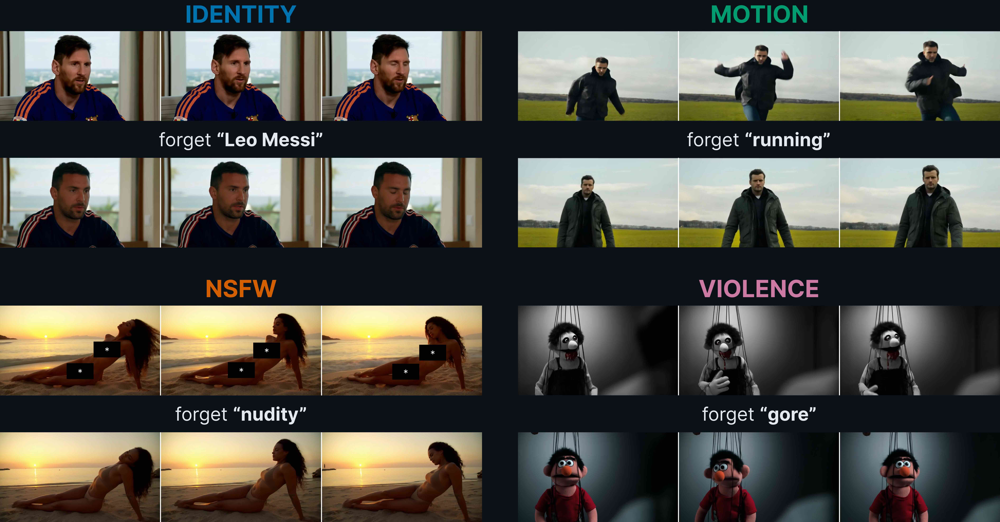
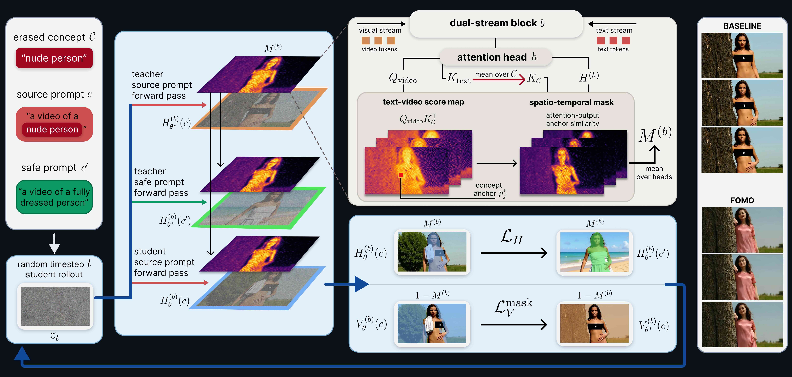

<div align="center">

<h1>FOMO: Forget the Concept, Don't Miss Out on the Scene<br>in Selective Video Unlearning</h1>

[Łukasz Rudnik](https://www.linkedin.com/in/lukaszrudnik/)<sup>1</sup>,
[Agnieszka Polowczyk](https://www.linkedin.com/in/agnieszka-polowczyk-91381323a/)<sup>1,2</sup>,
[Alicja Polowczyk](https://www.linkedin.com/in/alicja-polowczyk-064739266/)<sup>1,2</sup>,
[Przemysław Spurek](https://scholar.google.com/citations?hl=en&user=0kp0MbgAAAAJ)<sup>1,2</sup>

<sup>1</sup> Jagiellonian University &nbsp;&nbsp; <sup>2</sup> IDEAS Research Institute

[](https://arxiv.org/abs/2609.39605)
[](https://gmum.github.io/FOMO/)

<br>



&nbsp;

</div>

<p align="justify">
<b>Abstract:</b> The rapid advancement of generative video models has enabled the synthesis of increasingly realistic and temporally coherent videos, while also raising concerns about the generation of harmful content. The reliance on large-scale web datasets during training inevitably exposes these models to undesirable material, making concept unlearning an essential mitigation. Existing methods mainly target static visual concepts, such as objects, identities, or unsafe appearance, largely overlooking motion unlearning. Furthermore, these approaches often pay little attention to preserving the surrounding scene. As a result, successful concept removal may unintentionally alter the background, composition, or overall video dynamics. We argue that effective unlearning should ideally change only what is targeted, while minimizing unnecessary changes to the remaining scene. In this work, we introduce FOMO, to the best of our knowledge the first training-based selective video unlearning method that directly treats preservation of the original scene as a priority. We formulate unlearning around two complementary objectives: what to change and what to preserve. Our method localizes concept-related representations and modifies them, while the preservation mechanism maintains non-target scene information without requiring auxiliary data. Beyond simply erasing unwanted concepts, FOMO explicitly redirects the generation toward a specified safe alternative. We further extend this formulation to motion unlearning, where the concept is defined by temporal behavior rather than a fixed spatial region. Our solution achieves effective unlearning across unsafe content, object, and motion concepts, while achieving the best trade-off between concept removal and scene preservation.
</p>

<div align="center">



<br>

### [**→ Setup and usage ←**](SETUP.md)

</div>

## ✅ Project Status

- [x] Paper on arXiv
- [x] Project page with examples
- [x] Training and inference code
- [ ] Evaluation code
- [ ] Pretrained adapters

## 🔥 News

- **[2026.10.01]** Paper released on arXiv.

## Citation

If you find our work useful, please consider citing:

```bibtex
@misc{rudnik2026fomoforgetconceptdont,
      title={FOMO: Forget the Concept, Don't Miss Out on the Scene in Selective Video Unlearning},
      author={Łukasz Rudnik and Agnieszka Polowczyk and Alicja Polowczyk and Przemysław Spurek},
      year={2026},
      eprint={2609.39605},
      archivePrefix={arXiv},
      primaryClass={cs.CV},
      url={https://arxiv.org/abs/2609.39605},
}
```

## Acknowledgements

TODO
